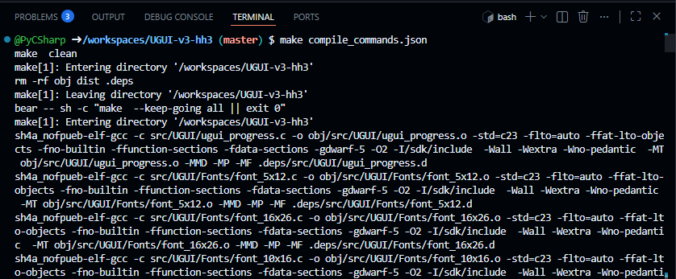
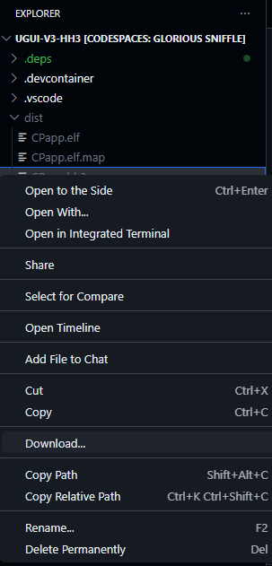
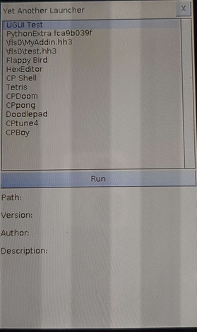

# CP Base Template
The CP App Template featuring a complete stdlib

## Usage
First, fork this repo to work on your own :
<a href="https://github.com/TheRainbowPhoenix/CPAppTemplate/fork">
  
</p>

Find a cool name for it :
<a href="https://github.com/TheRainbowPhoenix/CPAppTemplate/fork">
  
</p>

Forking will take a few seconds.

Once done, open the forked repo on a codespace :
<p>
   Codespaces > Create codespace on master"/>
</p>

You'll see a message telling it's creating, please wait for a while


<p>
  
</p>


On the terminal, use `make compile_commands.json` to generate an HH3 file and the compile_commands.json file

<p>
  
</p>

You can now download generated files. If you run into issues during this step, please see [Getting support](#getting-support)

<p>
  
</p>

Plug your calculator on your desktop and choose "USB Flash" mode.
<p>
  
</p>


Go into your file explorer, on the "USB Drive" that's the calculator, and then copy at the root of it your `CPapp.hh3`
Then, eject the Classpad Mass Storage device by right clicking on notifications > "Safely remove device"

Finally on your calculator, go in "System" from the home screen, "System" from the top menu and "Hollyhock-2 Launcher"
You should see the "UGUI Test" on the list and you can "Run" it
<p>
  
</p>

## What to do next

You can edit the `main.cpp` file to add your own logic and build whatever you want. Be sure to remember that you're coding on embed hardware, and most of the C/C++ funtion you know won't work there (say `printf`).

First thing you can do is edit the first lines that describe your app :
```
APP_NAME("My app name")
APP_DESCRIPTION("A short description of my app")
APP_AUTHOR("My name")
APP_VERSION("1.0.2")
```

Then, you can take a look at the [beginners tutorials](#TODO) to build some simple programs and even small games.

For more information, you can explore the [docs](https://classpaddev.github.io/) or get some inspiration by looking at the [demos](#TODO)

## Getting support

If you need help, feel free to join our community both in [Discord](https://discord.gg/knpcNJTzpd) and [Reddit](https://www.reddit.com/r/fxcp400/)
